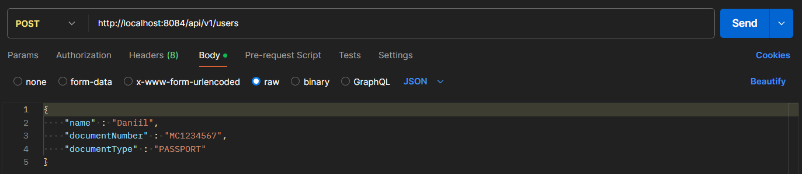
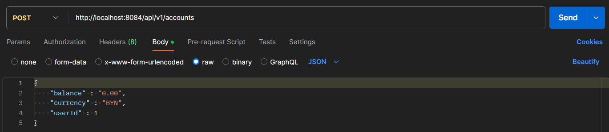
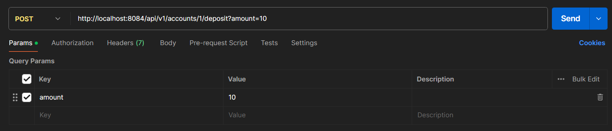

## Инструкция по запуску проекта

### Шаг 1: Склонировать себе репозиторий

### Шаг 2: Перейти в консоли в директорию с файлом docker-compose.yml

### Шаг 3: Прописать команду docker-compose up

### OpenAPI документация будет доступна по ссылке http://localhost:8084/swagger-ui/index.html

## Порядок действий для пополнения счета

- Создать пользователя
- Создать счет для этого пользователя
- Произвести пополнение счета для этого пользователя